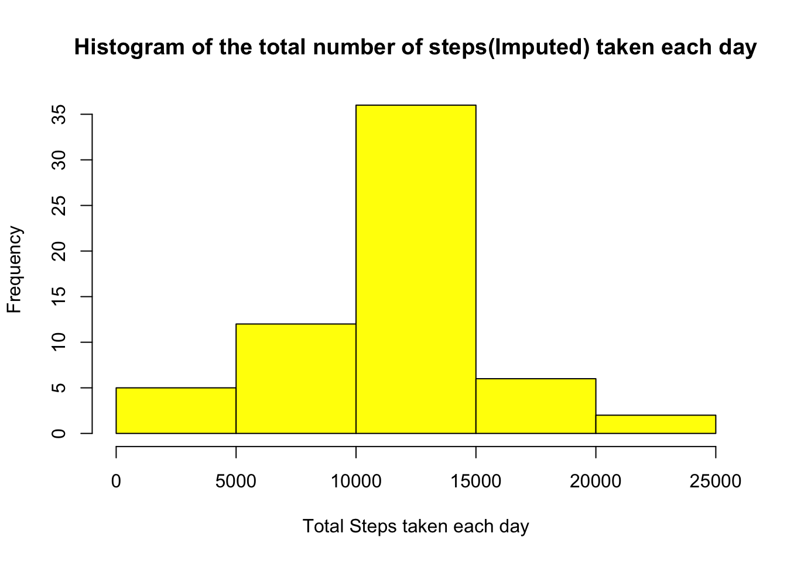

  
**Important Note:** *Kindly visit the below link for for updated report. The plots are available in the figures folder.  
rpubs  --> [http://rpubs.com/bram/reproducibileresearch](http://rpubs.com/bram/reproducibileresearch)   
github --> [https://github.com/buva-datascience/RepData_PeerAssessment1](https://github.com/buva-datascience/RepData_PeerAssessment1)*    
      
#Introduction
--------------
With the current advancement of technical possibilities, collecting BIG amounts of data about personal movement using activity monitoring devices such as a **Fitbit, Nike Fuelband,** or **Jawbone Up** are nowadays quite possible. These devices are part of the *“quantified self”* movement – a group of enthusiasts who take measurements about themselves regularly to improve their health, to find patterns in their behavior, or because they are tech geeks. But these data remain under-utilized both because the raw data are hard to obtain and there is a lack of statistical methods and software for processing and interpreting the data.

This assignment makes use of data from a personal activity monitoring device to collect data at 5 minute intervals through out the day. The data consists of two months of data from an anonymous individual collected during the months of October and November, 2012 and include the number of steps taken in 5 minute intervals each day. The goal of this assignment is to perform an exploratory analysis with the available data and document the findings in a reproducible format for future use.

#Structure of Data 
-------------------
The data is pretty much structured in observations in 5 - minute intervals for a said day. The same time interval pattern is repeated for all of the days which are taken into account. Some of the observations had missing values. The dataset is stored in a comma-separated-value (CSV) file and there are a total of 17,568 observations in this dataset.

The variables included in this dataset are:  
1. **steps:** Number of steps taking in a 5-minute interval (missing values are coded as NA)  
2. **date:**  The date on which the measurement was taken in YYYY-MM-DD format  
3. **interval:** Identifier for the 5-minute interval in which measurement was taken  

#Analysis Process
------------------
At a high level this assignment is carried out in 5 high level steps given as below:
1. Download and Preprocess the data
2. Calculate the mean total number of steps per day and draw a histogram of the total number of steps taken each day.
3. Determine the Average daily activity pattern: Make a time series plot of the 5-minute interval vs. average number of steps taken, averaged across all days (y-axis). With the findings find out the time interval which had the maximum number of steps.
4. Imputing missing values: Missing values in the dataset might cause calculations and findings to be biased. To avoid that, missing values were imputed with the mean step for the same 5-minute time interval. i.e., For a specific day/time interval instance the missing value was replaced with the mean steps for the same interval for all the other days. There were **2304 missing values** which were imputed and the mean/median recalculated and the differences were observed and reported.
5. Activity patterns during Weekdays vs. Weekends: The data was factored into weekdays and weekends and the Step#3 was performed again to draw a time series multiple panel plot to analyse the outcome.
  

## Step:1 -- Loading and preprocessing the data    
The data processing is done as following:  
 1. Source file "**activity.zip**" is downloaded if not present  
 2. Source data is unzipped using unz() function and read via the read.csv() function  
 3. Examine the dataframe using header() and str() functions* 

```r
# load datatable package
library(data.table)     

# function to Download the file from the website location to the local directory
dwld_file <- function(fileurl, dest){
        if (!file.exists("data")) dir.create("data")                            # create a folder if it doesnt exist        
        
        if (!file.exists(dest)) {                                               # download the file if its not already downloaded
                download.file(fileurl, destfile = dest, method = "curl")
        }
}

# Set local destination folder
dest="./data/activity.zip"

# Call funtion to download from the url
dwld_file("https://d396qusza40orc.cloudfront.net/repdata%2Fdata%2Factivity.zip", dest)

# List the files in zip
unzip(dest, list=T)

# set working directory
wd <- "~/Documents/Buva/Data Science/Data Science Course-John Hopkins/05-Reproducible Research/Peer Assessment#1"
setwd(wd)

# Set the directory of the file
dest="./data/activity.zip"                                      

# Unzip and read into a dataframe        
ActivityTable <- read.csv(unz(dest, filename="activity.csv"))   

# Examine dataframe
head(ActivityTable)       
str(ActivityTable)
```
      
## Step:2 -- What is mean total number of steps taken per day? Draw a histogram of the total number of steps taken each day.  
For this exercise, we are going to ignore the NAs in the dataset. Identify the NAs and ignore them. Calculate the mean total steps using the tapply() function and convert the date into a factor. Draw a histogram

```r
# ignore NAs
Activities <- ActivityTable[!is.na(ActivityTable$steps),]      

# Convert date as factor
Activities$date <- factor(as.character(Activities$date))        

# Convert interval as factor
Activities$interval <- factor(Activities$interval)       

# Calculate mean steps taken each day using tapply()
meanSteps <- tapply(Activities$steps, Activities$date, mean, na.rm=T) 

# Caluculate the total steps taken each day using tapply()
totalSteps <- tapply(Activities$steps, Activities$date, sum, na.rm=T)

# Create a histogram for the total steps taken each day
hist(totalSteps, xlab="Total Steps taken each day", main="Histogram of the total number of steps taken each day", col=555 )
```


Mean and Median are calculated and reported as below:
```r
# Mean of the total number of steps taken per day 
mean(totalSteps)
# Median of the total number of steps taken per day 
median(totalSteps)
```
    
## Step:3 -- What is the average daily activity pattern?    
Calculate the average steps taken per the 5 minute interval using tapply() function and draw a time series plot. Determine the maximum number of steps taken in a time period and report the same. Also observe the same in the time series plot created.

```r
# Calculate mean avg steps taken per 5 min interval for all the days
timeInterval <- tapply(Activities$steps, Activities$interval, mean, na.rm=T)

# Draw a time series plot 
plot(row.names(timeInterval), timeInterval, type = "l", xlab = "5-min interval", 
     ylab = "Average steps taken across all Days", main = "Time Series of Avg. Steps taken per 5-minute interval", 
     col = "blue")  

# Find the max. number of steps across the time intervals
TI <- aggregate( steps ~ interval, Activities, na.rm=TRUE, mean)

TI[which.max(TI$steps),]
```


  
## Step:4 -- Imputing missing values    
Identify the missing values and filter ONLY those rows to another dataframe.          
```r
# Subset the NAs into a different dataframe
NAs <- ActivityTable[is.na(ActivityTable),]

# Find the number of NAs
nrow(NAs)
sum(is.na(ActivityTable))
```
For imputing the missing values, fill in all missing values with the mean step for the same 5-minute time interval. Merge the datasets to form the original dataset with filled in values, then draw a histogram of total steps taken each day  
      
```r
# Convert date as factor
NAs$date <- factor(as.character(NAs$date))

# Fill in all missing values with the mean step for the same 5-minute time interval
for( i in 1:nrow(NAs)){
        for ( j in 1:nrow(TI)){
                # Assign the mean step value for the same 5-minute time interval for the missing value        
                if( NAs$interval[i] == TI$interval[j])  NAs$steps[i] <- TI$steps[j]
        }
}

# create a new dataframe with the filled in NA values which is equal to the original dataset
newActivity <- rbind(Activities, NAs)

# Calculate mean steps taken each day using tapply()
newmeanSteps <- tapply(newActivity$steps, newActivity$date, mean, na.rm=T)

# Caluculate the total steps taken each day using tapply()
newtotalSteps <- tapply(newActivity$steps, newActivity$date, sum, na.rm=T)

# Create a histogram for the total steps taken each day with fill ins instead of NAs
hist(newtotalSteps, xlab="Total Steps taken each day", main="Histogram of the total number of steps(Imputed) taken each day", col=999 )
```


After filling the missing values, the Median and Mean of the total number of steps taken per day for the new dataset are calculated and compared against the previously found mean and median with the Step2. *Kindly note that due to the imputing of missing values, median value is impacted with a a little difference, however there is no change to the mean values.*
  
```r
# Mean of the total number of steps taken per day 
mean(newtotalSteps)
# Median of the total number of steps taken per day 
median(newtotalSteps)
```         
  
## Step:5 -- Activity patterns during Weekdays vs. Weekends
Using the weekdays function create a new factor variable to hold the day types to identify weekend and weekdays. Create a dataframe which holds the Avg. steps taken per 5 min interval for all weekends and weekdays. Using **ggplot2**, Draw a Time Series qplot of Avg. Steps taken per 5-minute interval on all Weekdays and Weekends, in 2 panels
  
```{r daytype, echo=TRUE}
# check for the type of days in the dataset
table(format(as.Date(newActivity$date),"%A"))

# create a new variable dataType with weekends and weekdays as values
newActivity$dayType <- ifelse(weekdays(as.Date(newActivity$date)) %in%  c("Saturday", "Sunday"),'weekend','weekday')

# convert dayType to a factor
newActivity$dayType <- factor(newActivity$dayType)

# Calculate mean avg steps taken per 5 min interval/dayType for all the days
plotDF <- aggregate(steps ~ interval+dayType, newActivity, mean)

# convert interval factor to a numeric 
plotDF$interval <- as.numeric(as.character(plotDF$interval))

# load ggplot2
library(ggplot2)

# Draw a timeseries plot
qplot(x=interval, y=steps, data=plotDF, xlab = "5-min interval", 
      ylab = "Avg. steps taken across all WeekDays/Weekends", geom=c("line"),
      main = "Time Series- Avg. Steps per 5-min interval on all Weekdays/Weekends") + facet_wrap(~ dayType, ncol=1) 
```


*Free up the environment memory as we have completed the assignment !*
```{r freeup, echo=TRUE}
rm(list=ls())
```
    


  